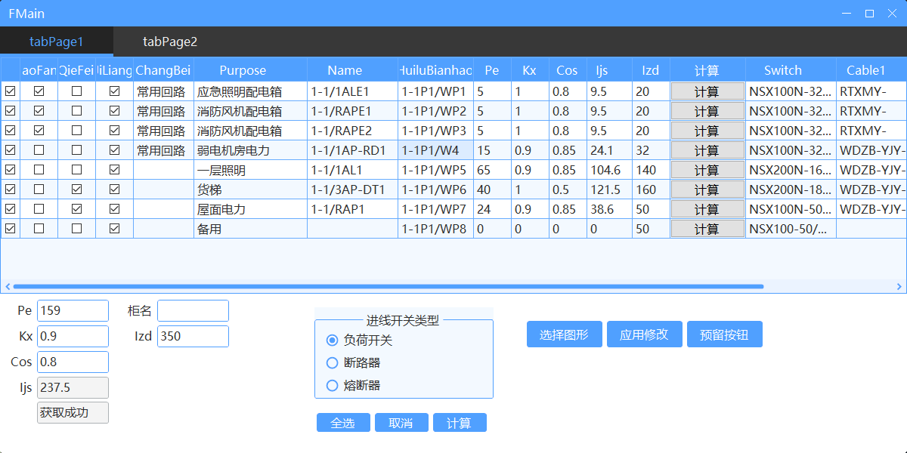

#### 每日记录

230911

1. private decimal cal_row(DataGridViewRow row)函数待增加：根据柜名自动补全柜号
2. 功能待补充：修改进线柜的开关及对应的radiongroup、互感器




#### 列定义

```C#
//列号命名：用名称替换序号，仅在开头定义后，后续调整无需复核列号
//块名
uiDataGridView1.Columns[1].Name = "块名";
//块OBJID
uiDataGridView1.Columns[2].Name = "OBJID";
//块位置
uiDataGridView1.Columns[3].Name = "块位置";
//消防
uiDataGridView1.Columns[4].Name = "消防";
//切非
uiDataGridView1.Columns[5].Name = "切非";
//计量
uiDataGridView1.Columns[6].Name = "计量";
//常备用
uiDataGridView1.Columns[7].Name = "常备用";
//回路用途
uiDataGridView1.Columns[8].Name = "回路用途";
//箱名编号
uiDataGridView1.Columns[9].Name = "箱名编号";
//回路编号
uiDataGridView1.Columns[10].Name = "回路编号";
//Pe
uiDataGridView1.Columns[11].Name = "Pe";
//Kx
uiDataGridView1.Columns[12].Name = "Kx";
//Cos
uiDataGridView1.Columns[13].Name = "Cos";
//Ijs
uiDataGridView1.Columns[14].Name = "Ijs";
//Izd
uiDataGridView1.Columns[15].Name = "Izd";
//断路器
uiDataGridView1.Columns[17].Name = "断路器";
//电缆类型
uiDataGridView1.Columns[18].Name = "电缆类型";
//电缆截面
uiDataGridView1.Columns[19].Name = "电缆截面";
//互感器
uiDataGridView1.Columns[20].Name = "互感器";
```


#### 功能代码记录


```C#
//9.更新块的可见性
id.SetDynBlockValue("可见性1", strVisibility);

```

